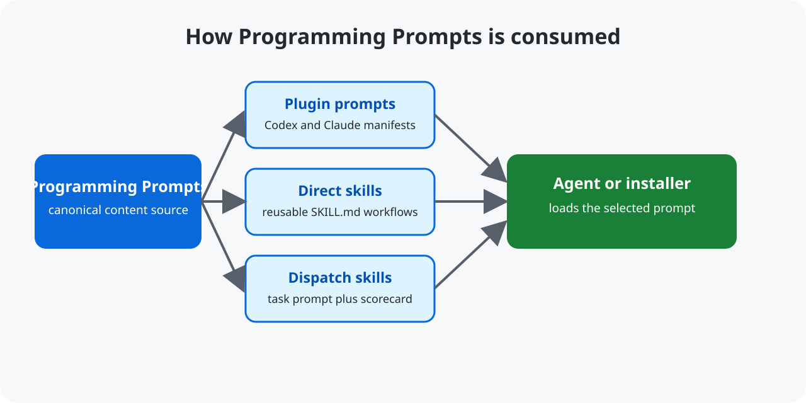

# Programming Prompts — AI Coding-Agent Prompts

[](https://github.com/mikaeltorni/programming_prompts/commits/master)
[](https://github.com/mikaeltorni/programming_prompts/graphs/commit-activity)
[](https://github.com/mikaeltorni/programming_prompts/issues)

Programming Prompts is a prompt library that provides reusable AI coding-agent prompts and engineering guidance for Codex and Claude Code users.



This repository is the canonical content source for the engineering standards
used across this workspace's projects. It contains installable plugins, direct
skills, and dispatch skills; the separate installer repository owns marketplace
generation and deployment.

## Contents

- [AI coding-agent prompt features](#ai-coding-agent-prompt-features)
- [Installation and usage of AI coding-agent prompts](#installation-and-usage-of-ai-coding-agent-prompts)
- [Plugins](#plugins)
- [Direct Skills](#direct-skills)
- [Testing](#testing)
- [Troubleshooting and FAQ](#troubleshooting-and-faq)
- [Contributing](#contributing)

The install catalog intentionally distinguishes plugins from direct skills:

- Plugins: Commit Guidelines and Linux Desktop Configuration.
- Direct skills: Docs, Init Project,
  Refactoring, Setup Repository Guidelines, and Workflow.
- Python Logging is retired and has been removed from this repository.

## Repository dependencies

This repository has no runtime dependency.

Repository ownership and routing are documented in [AGENTS.md](AGENTS.md).

Related research is documented in [Prompt Engineering for Software Development](https://github.com/mikaeltorni/prompt_engineering_for_software_development),
and challenge generation is covered by the
[Prompt Challenge Generator](https://github.com/mikaeltorni/prompt_challenge_generator).
For local conventional commit suggestions from Git diffs, see the
[coding_tools local AI commit message generator](https://github.com/mikaeltorni/coding_tools).

## Quickstart

Clone the content source and inspect a skill directly:

```bash
git clone https://github.com/mikaeltorni/programming_prompts.git
cd programming_prompts
sed -n '1,120p' programming_prompt_rewritten_with_evals/prompts/programming-skills/testing/SKILL.md
```

The command prints the independent testing skill. The programming suite
contains workflow, commits, worktree, docs, srp, commenting, logging, debug,
and testing; see its [skill catalog](programming_prompt_rewritten_with_evals/prompts/programming-skills/README.md).

## AI coding-agent prompt features

This repository maintains the canonical engineering standards used across all
development projects in this workspace. Plugin prompts package exactly one skill
and carry manifests for both Codex and Claude Code; direct skills carry only
`SKILL.md` content.

- **Testing Skill** — Focused regression checks, public-interface coverage, existing project tooling, and isolated execution; source: [testing](programming_prompt_rewritten_with_evals/prompts/programming-skills/testing/SKILL.md).
- **Workflow Skill** — Explicit-only orchestration that plans first, coordinates only selected companion skills, always writes code, and conditionally uses worktree and documentation guidance.
- **Docs Skill** — User-facing project documentation for completed programming changes.
- **Commit Guidelines** — Cautious Git commit workflow (inspect → plan → stage hunks → verify → compose).
- **SSH VM** — Connect to a VM for remote software deployment or verification, with Ubuntu live USB setup guidance.
- **Linux Desktop Configuration** — Shared GNOME/Ubuntu desktop rules: applying changes silently from the command line (gsettings/dconf live, `systemctl --user restart`, `gnome-extensions enable/disable`), activating edited extension code with the sanctioned in-place X11 run-dialog reload (`xdotool` `Alt+F2 r`) while still forbidding destructive session restarts, asking for manual logout to activate extension code on Wayland, preserving user sessions, maintaining clean-install compatibility, and using root-optional (sudo-free) installer patterns.
- **Refactoring Skill** — Test-driven refactoring methodology for restructuring monolithic codebases into clean modules.
- **Init Project Skill** — Auto-triggered secure project initialization with UV + supply-chain protection.
- **Setup Repository Guidelines** — On-request (or new-project) repository-family routing and installer integration based on the orchestration manifest; no longer auto-triggered on every task.

## Repository Structure

```
programming_prompts/
├── AGENTS.md                               # Rule: no marketplace files in this repo
├── plugins/                                # One directory per plugin; each has
│   │                                       #   .codex-plugin/ + .claude-plugin/ manifests
│   │                                       #   and exactly one skills/<name>/SKILL.md
│   ├── commit-guidelines/                  # Cautious Git commit workflow
│   ├── linux-desktop-configuration/        # Console-only desktop deployment + sudo-free installers
├── skills/                                 # Direct skills, not plugins
│   ├── workflow/                            # Explicit-only programming orchestrator
│   ├── docs/                                # Post-code project documentation
│   ├── init-project/                       # Secure init with UV + supply-chain protection
│   ├── refactoring/                        # Test-driven refactoring workflow
│   ├── setup-repository-guidelines/        # On-request setup-family routing & install policy
│   └── ssh-vm/                             # SSH deployment and testing on a VM
├── dispatch-skills/                        # Menu-selectable task skills: repo in, score out
│   ├── github-seo/                        # GitHub discoverability audit, scored 0–100, looped
│   ├── github-portfolio-scan/             # Directory-wide resume/portfolio release-readiness audit
│   └── worktree-cleanup/                  # Finished-worktree reclaim, scored, never stored
├── tests/                                  # pytest policy tests for the plugin prompts
├── .log/                                  # Runtime logs (gitignored)
├── LICENSE.md                             # MIT License
└── README.md                              # This file
```

## Installation and usage of AI coding-agent prompts

Installation belongs to the sibling installer repository. Its committed
`default.json` maps each prompt to either a plugin or a direct skill and
controls default selection. This repository intentionally
contains no `install.sh`, installer libraries, or marketplace catalogs — marketplace
generation is owned entirely by the installer repository (see `AGENTS.md`). Each
`plugins/<name>` directory stays standalone-installable via its own Codex and
Claude manifests plus its single skill. Top-level `skills/<name>` directories
are installed directly as skills and do not appear in plugin marketplaces.

## Plugins

### commit-guidelines

Packages the cautious Git commit workflow as a Codex/Claude plugin (skill name:
`commit`). Guides agents to inspect all changes (staged + unstaged), split diffs
into logical commits, stage exact hunks, and compose clean conventional commits,
executing the complete cross-repository commit plan in one run.

**Install:** The programming-prompts marketplace installs this as `commit-guidelines@programming-prompts`. Confirm with:
```bash
codex plugin list
```

### linux-desktop-configuration

Packages the shared Linux desktop configuration rules as a Codex plugin (skill name: `linux-configuration`). Applies to any task touching GNOME Shell extensions, gsettings, themes, hotkeys, systemd user services, or repository installers:

- **Apply changes silently from the console:** most changes need no Shell reload — `gsettings set` (hotkeys/themes/shell keys/an extension's own settings) applies live, `systemctl --user restart <unit>` restarts only the affected service, and `gnome-extensions enable/disable` toggles extension state without a GUI flash. For extension *code* changes, deploy and verify the files, then activate the edited source with the in-place reload that matches the session: on X11 drive GNOME's run dialog with `xdotool` (`Alt+F2 r`) to restart the Shell in place; on Wayland ask the user to log out and back in. Never force changes through with logout, reboot, `gnome-shell --replace`, or shell-kill commands.
- **Clean installation compatibility:** every change must reproduce on a fresh checkout via `installation_scripts/install.sh`; installers stay idempotent.
- **Root-optional installers:** all project `install.sh` scripts run sudo-free in user mode (root-only steps are skipped and reported via `SUDO_REQUIRED_STEPS`); only `linux_installations_setup` hard-requires root.

**Install:** The programming-prompts marketplace installs it as `linux-desktop-configuration@programming-prompts`. Confirm with:
```bash
codex plugin list
```

## Direct Skills

### ssh-vm

Use `$ssh-vm`, or let it apply automatically, for tasks that deploy or test
software on a VM over SSH. On first contact, if the user provides an IP or
hostname without confirming SSH setup, it gives Ubuntu VM-console setup
commands, including setting the account password, and waits for confirmation
before any network attempt. Once confirmed, it connects using a key or an
interactive password prompt, updates the project copy, and installs and checks
it on the VM. For visual behavior, it captures and inspects a VM screenshot
when a safe capture path is available. If visual confirmation would help but
no capture path exists, it asks the user for a screenshot. SSH alone does not
guarantee guest desktop access. Installed as a native skill under each
harness's skill directory.

### workflow

An explicit-only orchestrator for programming tasks. Invoke `$workflow` to
create a repository-local Markdown plan, apply only the companion skills
enabled in the current prompt, write the code, and conditionally use worktree
or documentation guidance when those companions are enabled. With no companion
skills it falls back to plan-then-code. Installing or discovering the skill
does not activate it, and other skills do not depend on it.

### docs

Writes or updates the user-facing documentation affected by a completed code
change. It covers the public entrypoint, commands or API, supported inputs,
configuration, and important usage constraints without taking ownership of
function docstrings from a separately selected commenting skill.

### testing and the programming suite

The independent [testing skill](programming_prompt_rewritten_with_evals/prompts/programming-skills/testing/SKILL.md)
requires reusable behavior checks, bug regressions, meaningful public-interface
coverage, isolated execution, and existing project tooling. Static content uses
direct checks or the project's prescribed evaluation method. It does not create
CI or install a new test framework by default.

Agent Command Center's default installation enables V2 `commits`, `worktree`,
`workflow`, `docs`, and `testing`. Other skills remain independently selectable;
manual selections are preserved. Apply this baseline across every harness with:

```bash
acc pp enable --both --skill v2:commits,v2:worktree,v2:workflow,v2:docs,v2:testing
```

```bash
acc pp status --both --skill commits,worktree,workflow,docs,testing --check
```

The generic programming guidelines and their global bootstrap are retired and
removed. Installer postflight disables their previous managed blocks and native
skill paths, including registered Codex accounts. Existing conversations may
retain previously supplied instructions; new sessions receive the current
selection. Python setup remains owned by `init-project`, and desktop deployment
remains owned by `linux-configuration`.

The testing skill has a semantic Harbor judge under `evals/judges/testing/`.
Default benchmark skill discovery and shipped launcher presets select the eight
companions (`commenting`, `commits`, `debug`, `docs`, `logging`, `srp`,
`testing`, `worktree`). `workflow` stays explicit `--skills workflow`.
To evaluate the full suite including workflow:

```bash
cd programming_prompt_rewritten_with_evals/evals
```

```bash
ACC_CODEX_INSTANCE=1 ./run_benchmark.sh --harness codex --eval-agent codex --skills workflow,commits,worktree,docs,srp,commenting,logging,debug,testing -k 3
```

Run one benchmark wrapper at a time. Judge verdicts inspect saved checks against
the original request; without an agent trace, execution order remains unverified.

### init-project

Secure project initialization as a direct skill. Guides agents to set up new projects with UV by Astral as the required package manager, implementing a rolling 24-hour publication delay via uv's native `[tool.uv] exclude-newer = "24 hours"` setting to protect against supply-chain attacks. Plain `pip` installs must consume a hash-locked `uv export` rather than resolve dependencies directly.

### refactoring

A direct skill that implements the **Test-Driven Refactoring** paradigm. Guides agents to restructure monolithic codebases into well-organized, single-responsibility modules without changing behavior — tests first, then extraction, then integration.

Key principles:
1. Analyze before touching code (identify monoliths, orphaned functions, missing tests).
2. Plan the module structure with clear responsibilities.
3. Write tests for existing functionality before extracting anything.
4. Extract one cohesive module at a time by default; for explicitly broad workspace requests, inventory every repository first and verify each extraction independently.
5. Update imports, documentation, logging paths, and project tree after each extraction.
6. Commit each completed extraction in the task worktree by default.

### setup-repository-guidelines

A direct skill (not an auto-applied global instruction) that applies owner
routing, component selection, clean-install, deployment, and prompt-free
keyring requirements to the repository family discovered from the sibling
`installation_scripts` manifest. Invoke it only when the user requests repository
initialization or explicitly invokes `setup-repository-guidelines` by name or tag
(`$setup-repository-guidelines` or `/setup-repository-guidelines`). Missing
guidelines or a new directory do not trigger it. It is not merged into
`AGENTS.md`/`CLAUDE.md` as a managed
global conditional that fires at the start of every task. Membership is still
read dynamically from `CLONE_REPOS`, so newly added repositories enter scope
without changing this skill.

## Dispatch Skills

`dispatch-skills/` holds the task prompts that are meaningful with no context
beyond "here is a repository". They are the only prompts offered by the
notes-app skill menu, which launches one agent per selected project with the
harness-native invocation — `/name` for Claude Code, Cline, and Grok, `$name`
for the Codex family — built from the skill's directory name.

A prompt qualifies for this folder only if it defines a measurable score — kept
in a tracked scorecard file, or reported in the run output when storing the
audit would commit private detail — and an improvement loop with an explicit
stop condition; see [`dispatch-skills/README.md`](dispatch-skills/README.md).

### github-portfolio-scan

Audits **any directory** of git checkouts for GitHub resume / portfolio
release-readiness. It inventories live original repositories, scores each one
on product story, docs, tests, license, secrets, personal-machine coupling, and
authorship, then reports a tier list with evidenced positives and flaws. The
run is read-only: it does not edit, push, or change visibility, and it does not
apply SEO extras — those wait for a later [`github-seo`](dispatch-skills/github-seo/SKILL.md)
dispatch after a repository is chosen for public release. The audit lives in
the run report, not in the scanned trees.

### github-seo

Audits a GitHub project's discoverability against a weighted 100-point rubric —
repository metadata and topics, README above the fold, keyword coverage,
AI/LLM citability (question-shaped FAQ, a quotable definitional
sentence), community health signals, docs-site technical SEO, registry presence,
cross-links, and freshness — minus penalties for keyword stuffing,
unsupported claims, badge and topic spam, artificial engagement, and dead links.
For mikaeltorni's repositories, per-criterion evidence and round history live
in the private `seo_optimization` repository, not in this public content
source. The loop closes the highest-value gap, re-measures from scratch, and
repeats until a re-audit independently reproduces 100/100, then switches to
maintenance. Points are only awarded against recorded evidence, and nothing is
published, renamed, or posted on the user's behalf.

## Logging

Per the programming guidelines, any repository-generated log files must be
written under the repository-root `.log/` directory (created on demand) and are
gitignored to keep the working tree clean. No runtime utilities currently ship
in this repository, but the convention is reserved for any that are added later:

```bash
# Repository-generated logs live here (gitignored)
.log/<component>.log
```

## Testing

Run the test suite with pytest:

```bash
python3 -m pytest tests -v
```

Each plugin is standalone-installable and can be validated directly:

```bash
claude plugin validate --strict plugins/<name>
codex plugin list
claude plugin list --json
```

The Harbor benchmark's public entrypoint is
[`run_benchmark.sh`](programming_prompt_rewritten_with_evals/evals/run_benchmark.sh).
Coding tasks live under
[`evals/coding-prompts/`](programming_prompt_rewritten_with_evals/evals/coding-prompts/);
`greeter` is the remaining log-driven debug task (`/app/greeter.py` →
`run_greeter` for `<name> <hour>`, `bye <name>`, and `period <hour>`).
The runner accepts `--harness`, selects the Codex judge with
`--eval-agent codex`, selects programming skills with `--skills`, and accepts
`--tasks`, `--concurrency`, `--baseline`, and Harbor's `-k` attempt count.
Without `--concurrency`, it requests all selected tasks × attempts in parallel,
subject to configured LLM caps and available per-trial Docker network slots.
Use `--concurrency N` only when you want an explicit limit; `-k` controls
attempts per task independently.
Run one benchmark invocation at a time. See the
[evals README](programming_prompt_rewritten_with_evals/evals/README.md) for the
command surface and [AGENTS.md](AGENTS.md) for the repository's run policy and
required full-suite command.

Selecting `--skills commits` explicitly invokes `$commits` in each isolated
task prompt and authorizes its local Git commits. The prompt directs the agent
to the supplied skill-catalog paths and explains that `/app` resolves to the
checkout at `/Projects/app`. Selecting `workflow` invokes `$workflow`
independently. Baseline and positive jobs receive the same selection context;
positive jobs also install the selected skill bodies.

The [SRP skill](programming_prompt_rewritten_with_evals/prompts/programming-skills/srp/SKILL.md)
also guides focused edits: start with a small working slice, extend its existing
helpers and command path, and preserve simple responsibilities as requirements
change. The `todo`, `bank`, and `stats` benchmark prompts repeatedly revise
earlier behavior as well as adding commands. Each stage requires public-entrypoint
checks and a working commit; the SRP judge receives historical source and diffs
to assess unnecessary churn alongside the final function structure. A justified
local extraction is allowed, and diff size alone is not the score.

Semantic judges receive the actual source, function boundaries, workflow plan,
and reachable commit history. A verdict that contradicts its own reason or
bounded source/plan evidence is retried once; both raw attempts remain in the
archived reward details. Unresolved inconsistent judgments and provider/auth
failures are reported as infrastructure exclusions. Check the archive as well
as the aggregate score: a reported pass can still miss a real artifact defect.
An empty Python source listing supports a missing-submission failure; mentioning
the requested filename alone does not make that verdict inconsistent.

Function contracts cover authored test methods, fixtures and assertion helpers
as well as the program: selected commenting requires inline `Parameters:` and
`Returns:` content, and selected logging requires each function's own parameter
entry trace and returned-value trace, including `None` on normal fallthrough.
The entry print precedes parsing and `global`/`nonlocal` declarations; a
parameterless function may print a literal entry message. A final `print(None)`
traces an implicit `None` return without requiring an explicit `return None`.
Logging verdicts must agree with the current source and function-boundary report.
Testing alone does not enable these companions. Write complete docstrings when
creating each function, including the initial regression test, and review test
methods independently of their assertions and logging. With SRP selected,
identify the parser and operation owners before the first source write. The
first working slice and repairs to existing code keep raw-command parsing,
state changes and computed results in helpers. The public dispatcher receives
an operation and its arguments from one shared parsing call before branching;
parsers may compose helpers internally. Extracting only formatting, token
conversion or history recording leaves the operation mixed.

The testing judge accepts meaningful saved assertion scripts or framework tests
by source inspection when execution is unavailable, with that limit disclosed.
It inspects available historical checks against their own revisions, so retired
rules are not required in the final suite. Missing historical source is an
unverified limit, rather than evidence that earlier tests were absent. Agents
should retain unaffected regressions and meaningful negative assertions as they
extend a suite; terminal-only assertions do not replace saved checks. Choose
and save runnable public-interface checks with each working revision, covering
explicitly requested empty commands, unknown operations and invalid argument
shapes when those rejection classes are part of the original contract.

Both debug and testing judges receive verifier-owned original failure logs
from `tests/task-logs/`. A saved regression assertion may use a literal expected
value that matches the original log; the test itself need not parse that log.
The docs checker treats authored test runners as checks rather than application
entrypoints and evaluates exclusions relative to the checkout, so an external
worktree's `.worktrees` parent does not hide its application source.

For stateful checks, establish fresh state before every independent case while
preserving state within each requested multi-call sequence. Fixture setup may
reset private state or load a fresh module; behavioral assertions use the
public interface. Run mutable suites again in the same process or another order
to check isolation. The testing judge traces repeatability case by case and
cites the actual conflicting assertion for an isolation failure. A no-op method
adds no coverage, but does not erase meaningful assertions elsewhere.

Before the first source write, verify the registered physical task path and
matching branch against the full `<parent>/.worktrees/<project>/<project>_<type>-<feature>`
layout. Derive the project component from the live repository basename.
Worktree recovery drafts belong inside the registered task checkout's `tmp/`,
keeping the external project worktree group free of stray files and unregistered
directories.

## Configuration

This content repository has no runtime configuration. Plugin manifests,
direct-skill directories, and `dispatch-skills/` are the source of truth; the
installer reads them when it deploys prompts to an agent environment.

## Troubleshooting and FAQ

### Where should I start with Programming Prompts?

Start with the [programming skill catalog](programming_prompt_rewritten_with_evals/prompts/programming-skills/README.md)
and select the capabilities your task needs. Use `workflow` for explicit
coordination and `testing` for verification. Browse the [plugin directories](plugins/)
for packaged Codex and Claude Code integrations.

### Is this repository a plugin marketplace?

No. It is the content source for plugins and skills. Marketplace generation and
installation are owned by the external installer workflow, so no marketplace
catalog is committed here.

### Which prompt is used for GitHub SEO audits?

Use the [github-seo dispatch skill](dispatch-skills/github-seo/SKILL.md). It
audits a repository, records a scorecard, and loops over verified gaps.

### Which prompt ranks a folder of repos for a GitHub resume portfolio?

Use the [github-portfolio-scan dispatch skill](dispatch-skills/github-portfolio-scan/SKILL.md).
Point it at any directory of git checkouts. It inventories live originals,
scores release-readiness, and reports positives and flaws without editing those
trees. Run `github-seo` only after you pick a repository to make public.

### How do I validate a plugin?

Run `claude plugin validate --strict plugins/<name>` from a checkout with the
Claude Code CLI installed. The two plugin directories each contain their own
Codex and Claude manifests.

### Why is there no install.sh in this repository?

The repository deliberately keeps deployment ownership in the sibling
installer. Direct skill and plugin content remains independently inspectable
and can also be installed from its directory by compatible CLIs.

## Contributing

Keep each skill self-contained, preserve the plugin/direct-skill ownership
rules in [AGENTS.md](AGENTS.md), and run `python3 -m pytest tests -v` before
opening a pull request. Changes to prompt-only content should include a clear
description of the behavior or policy they improve.

## License

This project is licensed under the [MIT License](LICENSE.md).

## Disclaimer

This software is provided under the MIT License on an **“as is”** basis, without warranties of any kind. To the maximum extent permitted by applicable law, the authors and copyright holders shall not be liable for any claims, damages, losses, or other liability arising from the use of this software.

You are solely responsible for determining whether this software is suitable, safe, lawful, and appropriate for your intended use. Unless explicitly stated otherwise, this project is general-purpose software and is not designed, tested, certified, or approved for safety-critical, medical, automotive, aviation, industrial-control, life-support, cybersecurity-critical, financial-critical, or other high-risk use cases.

The authors and copyright holders make no guarantees regarding security, reliability, availability, correctness, compliance, non-infringement, or fitness for any particular purpose.

This notice is intended to clarify the nature of the project and does not impose additional restrictions beyond the MIT License.
